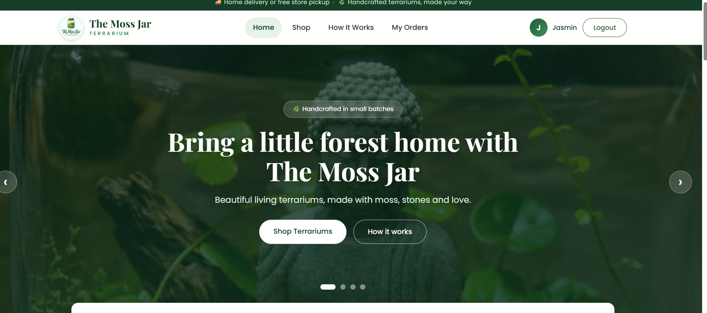
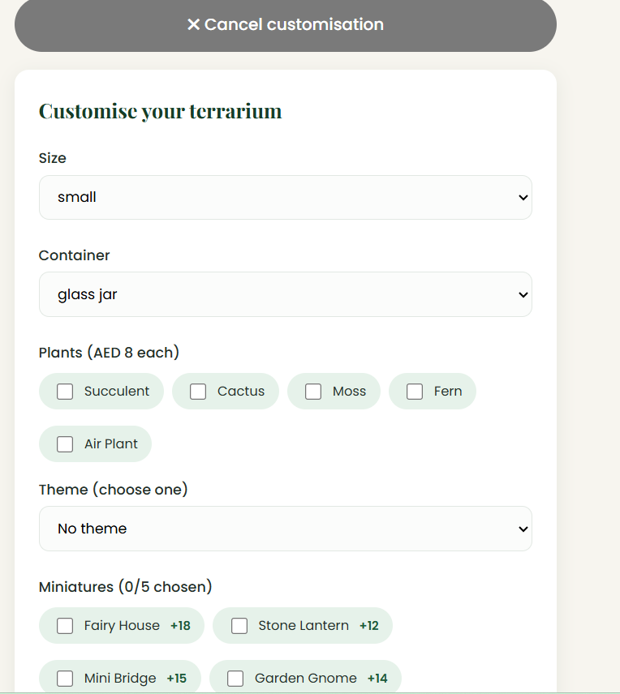
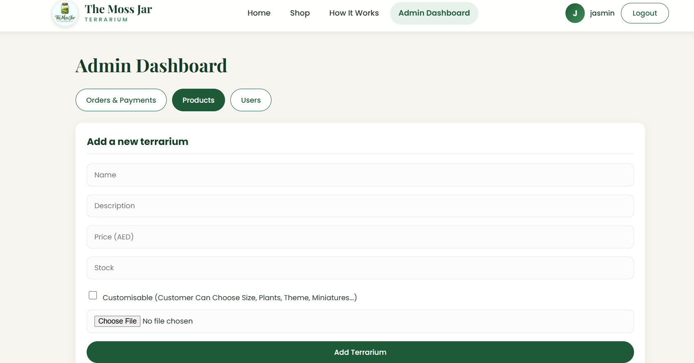

# 🌱 The Moss Jar

A full-stack e-commerce website for a handcrafted terrarium business. Customers can browse terrariums, customise them with themes, miniatures and sculptures, and pay by card or Cash on Delivery. An admin dashboard manages products, orders, payments and customers.

**Live site:** https://themossjar.vercel.app
**API:** https://themossjar.onrender.com

> The backend runs on a free Render plan, so the first visit after a period of inactivity can take 30 to 60 seconds to load.

---

## Screenshots

<!-- REPLACE: add screenshots to a "screenshots" folder in the repo, then keep these lines -->




---

## Features

### Customers
- Register and login with personal details (name, email, password, phone, address)
- Browse terrariums with photos
- Customise each terrarium: size, container, plants, theme, miniatures and sculptures, with a live price preview
- Add a gift message and choose the quantity
- Choose home delivery or store pickup
- Pay online with Stripe (test mode) or choose Cash on Delivery
- View order history with order status and payment status

### Admin
- Seeded admin account, created automatically on first run
- Add, edit and delete terrariums, with image upload to Cloudinary
- Update price and stock
- View all orders with customer details, customisation choices and payment status
- Update order status (Cash on Delivery is marked paid when delivered)
- Delete orders
- View all registered customers

### Website
- Hero slider and customer feedback carousel
- Responsive design with a mobile menu
- Professional navbar and footer

---

## Tech Stack

| Area | Technology |
|---|---|
| Frontend | React (Vite), React Router, Axios |
| Backend | Node.js, Express |
| Database | MongoDB Atlas, Mongoose |
| Authentication | JWT, bcryptjs |
| Payments | Stripe Checkout |
| Image storage | Cloudinary, Multer |
| Email | Nodemailer |
| Hosting | Vercel (frontend), Render (backend) |

---

## Security Highlights

- Passwords are hashed with bcrypt and never stored as plain text
- JWT tokens protect private routes
- Admin routes are protected on the server with role checks
- **The server calculates all prices**, so a customer cannot change a price from the browser
- Payments are verified with Stripe on the server before an order is marked as paid
- Secrets are kept in environment variables and are never committed to Git

---

## Project Structure

```
Themossjar/
├── backend/
│   ├── middleware/     # auth guards, image upload
│   ├── models/         # User, Product, Order
│   ├── routes/         # auth, products, orders, payments
│   ├── utils/          # Cloudinary, pricing, admin seed, email
│   └── server.js
├── frontend/
│   ├── public/         # logo
│   └── src/
│       ├── components/ # Navbar, Footer, HeroSlider, ProductCard...
│       ├── context/    # AuthContext
│       └── pages/      # Home, ProductDetails, Checkout, MyOrders, admin pages...
└── README.md
```

---

## Run It Locally

### 1. Requirements
- Node.js (LTS)
- A free MongoDB Atlas database
- Cloudinary account
- Stripe account (test mode)

### 2. Clone the project

```bash
git clone https://github.com/jasmin-spec/themossjar.git
cd themossjar
```

### 3. Backend

```bash
cd backend
npm install
```

Create `backend/.env`:

```
PORT=5000
MONGO_URI=your_mongodb_connection_string
JWT_SECRET=a_long_random_text

ADMIN_NAME=Admin
ADMIN_EMAIL=admin@example.com
ADMIN_PASSWORD=choose_a_strong_password

CLOUDINARY_CLOUD_NAME=your_cloud_name
CLOUDINARY_API_KEY=your_api_key
CLOUDINARY_API_SECRET=your_api_secret

STRIPE_SECRET_KEY=sk_test_your_key
CLIENT_URL=http://localhost:5173

EMAIL_USER=your_gmail_address
EMAIL_PASS=your_gmail_app_password
ADMIN_NOTIFY_EMAIL=where_to_receive_order_emails
```

Start the server:

```bash
npm run dev
```

### 4. Frontend

Open a second terminal:

```bash
cd frontend
npm install
```

Create `frontend/.env`:

```
VITE_API_URL=http://localhost:5000/api
```

Start the website:

```bash
npm run dev
```

Open **http://localhost:5173**.

### 5. Test payment

Use Stripe's test card:

```
Card number: 4242 4242 4242 4242
Expiry: any future date
CVC: any 3 digits
```

---

## API Overview

| Method | Endpoint | Access |
|---|---|---|
| POST | `/api/auth/register` | Public |
| POST | `/api/auth/login` | Public |
| GET | `/api/auth/users` | Admin |
| GET | `/api/products` | Public |
| POST / PUT / DELETE | `/api/products` | Admin |
| GET | `/api/orders/options` | Public |
| POST | `/api/orders` | Logged-in user |
| GET | `/api/orders/my` | Logged-in user |
| GET / PUT / DELETE | `/api/orders` | Admin |
| POST | `/api/payments/create-checkout-session/:orderId` | Logged-in user |
| POST | `/api/payments/verify` | Logged-in user |

---

## Deployment

- **Backend:** Render. Root directory `backend`, build command `npm install`, start command `npm start`, with the environment variables above.
- **Frontend:** Vercel. Root directory `frontend`, with `VITE_API_URL` pointing to the Render API. A `vercel.json` rewrite keeps page refreshes working.

---

## Future Improvements

- Shopping cart with multiple terrariums per order
- Several photos per terrarium
- Categories and search
- Stripe webhook as backup payment confirmation
- Status update emails for customers
- Live Stripe payments

---

## Author

**REPLACE: Your Name**
GitHub: [jasmin-spec](https://github.com/jasmin-spec)
LinkedIn: REPLACE with your link
Email: REPLACE with your email

---

*The Moss Jar is a learning and portfolio project built with the MERN stack.*